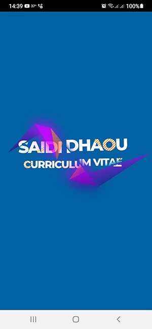
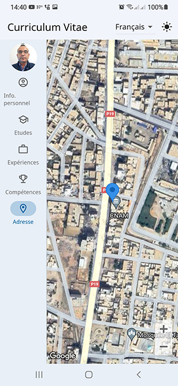

# 🚀 saididhaou CV App

Une application flutter présentant mon Curriculum Vitae.
Cette application est multilingue: Ar, Fr et En, elle permet à l'utilisateur de choisir entre le thème clair ou sombre en gardant son choix même après l'arrêt de l'application.

## 🚀 Authors

- [@saididhaou](https://www.github.com/saididhaou)

## 🚀 About Me

Etudiant en première année Master prof. en Developpement des Systèmes d'Information et Réseaux (DSIR) à ISET Sfax.

## Screenshots

## Packages utilisé:

- [flutter_native_splash](https://pub.dev/packages/flutter_native_splash)
- [flex_color_scheme](https://pub.dev/packages/flex_color_scheme)
- [shared_preferences](https://pub.dev/packages/shared_preferences)
- [flutter_localization](https://pub.dev/packages/flutter_localization)
- [url_launcher](https://pub.dev/packages/url_launcher)
- [google_maps_flutter](https://pub.dev/packages/google_maps_flutter)
